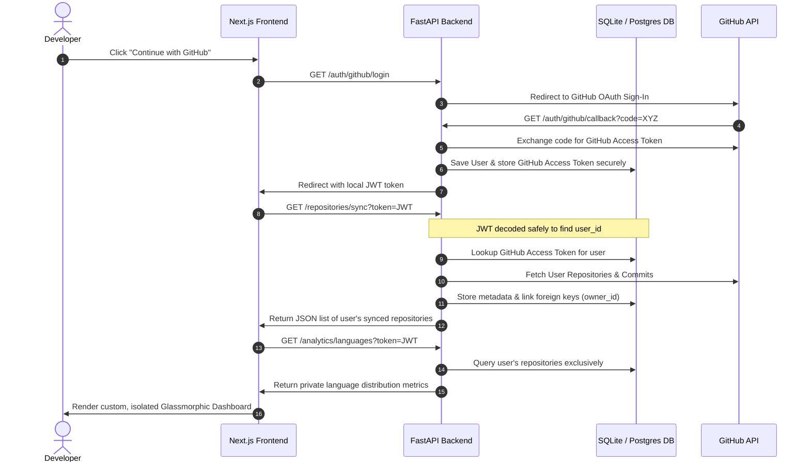

# ♾️ DualLoop Workspace
### The Continuous Fullstack Developer Diagnostics & Repository Analytics Dashboard

DualLoop is a fullstack web application designed for developer workspaces. It connects to GitHub using secure OAuth 2.0 protocols to synchronize repository metrics, track commit logs, and compute isolated programming language analytics inside a dark-themed cybernetic dashboard.

---

## 🏗️ Architecture & Security Model

DualLoop uses an isolated multi-tenant architecture to guarantee that all synced data, statistics, and repository metrics are visible **only to the authenticated owner**.



---

## 🛠️ Technology Stack

* **Frontend**: Next.js 16 (App Router), React 19, TypeScript, TailwindCSS v4 (Turbopack).
* **Backend**: FastAPI (Python), Uvicorn, SQLAlchemy ORM, Jose (JWT), HTTPX.
* **Database**: Persistent SQLite (development fallback) & PostgreSQL (production-ready).

---

## ⚙️ Configuration & Secrets (`.env`)

Create a `.env` file inside the `backend/` directory to store your environment variables:

```bash
# backend/.env
GITHUB_CLIENT_ID=your_github_oauth_client_id
GITHUB_CLIENT_SECRET=your_github_oauth_client_secret
FRONTEND_URL=http://localhost:3000
DATABASE_URL=sqlite:///./dualloop.db
```

> [!TIP]
> **Database Auto-Config**: If `DATABASE_URL` is omitted, the application will automatically fall back to creating a local persistent SQLite database (`dualloop.db`) in the root directory.

---

## 🚀 Step-by-Step Installation & Running Guide

### Prerequisites
* [Node.js](https://nodejs.org/) (v18.0 or higher)
* [Python](https://www.python.org/) (v3.10 or higher)
* A [GitHub OAuth App](https://github.com/settings/developers) registered with:
  * Homepage URL: `http://localhost:3000`
  * Authorization callback URL: `http://localhost:8000/auth/github/callback`

---

### Step 1: Run the Backend (Python)

Open a terminal in the root workspace directory:

```bash
# Navigate to the backend directory
cd backend

# Create a virtual environment (if not already created)
python -m venv venv

# Activate the virtual environment
# On Windows (PowerShell):
.\venv\Scripts\Activate.ps1
# On macOS/Linux:
source venv/bin/activate

# Install required packages
pip install -r requirements.txt

# Start the FastAPI development server
uvicorn app.main:app --reload
```

The backend server will start running on **`http://localhost:8000`**. On startup, the database engine will automatically run migrations and compile schemas in `dualloop.db`.

---

### Step 2: Run the Frontend (Next.js)

Open a second terminal in the root workspace directory:

```bash
# Navigate to the frontend directory
cd frontend

# Install Node modules
npm install

# Start the Turbopack Next.js development server
npm run dev
```

The frontend development server will spin up on **`http://localhost:3000`**.

---

## 🌐 Putting this Project on GitHub

We have configured a root-level `.gitignore` file to ensure database files, secret environments, and compiled Node modules are **not checked in**. Follow these steps to commit and push this repository safely:

```bash
# 1. Initialize Git in the workspace root directory (f:\dualloop)
git init

# 2. Add all files (the .gitignore will protect your secrets automatically)
git add .

# 3. Create your first commit
git commit -m "feat: complete fullstack workspace dashboard with isolated oauth analytics"

# 4. Create a new repository on your GitHub account and copy its URI.
# 5. Link the remote repository and rename the default branch to 'main'
git remote add origin https://github.com/your-username/dualloop.git
git branch -M main

# 6. Push the project to GitHub!
git push -u origin main
```

---

## 💎 Features Implemented & Optimized

* **Next.js Prerendering Fix**: Client Hooks (`useSearchParams`) are isolated inside a React `<Suspense>` boundary to guarantee a flawless production compile (`npm run build`).
* **Multi-tenant Analytics Security**: Restructured the analytics queries to decode incoming JWT identities, isolating metrics strictly on a per-user basis.
* **Full SQLite Database Fallback**: Out-of-the-box local testing capabilities without needing a PostgreSQL server daemon.
* **Type-Safe API Contracts**: Built strict, aligned interfaces between FastAPIs and client-side states to prevent browser render crashes.
